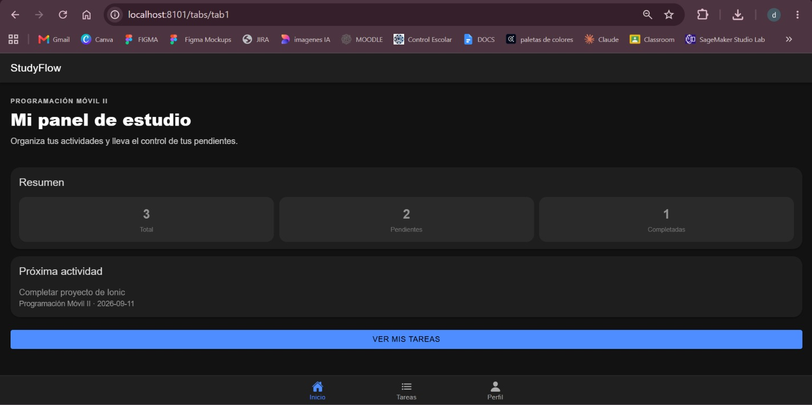
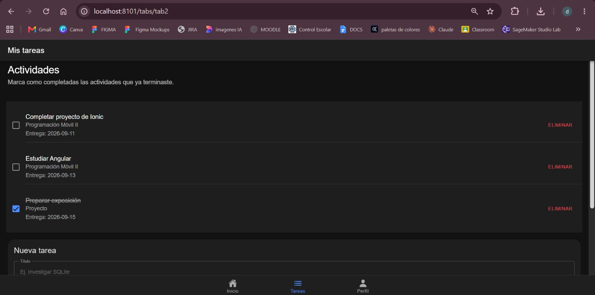
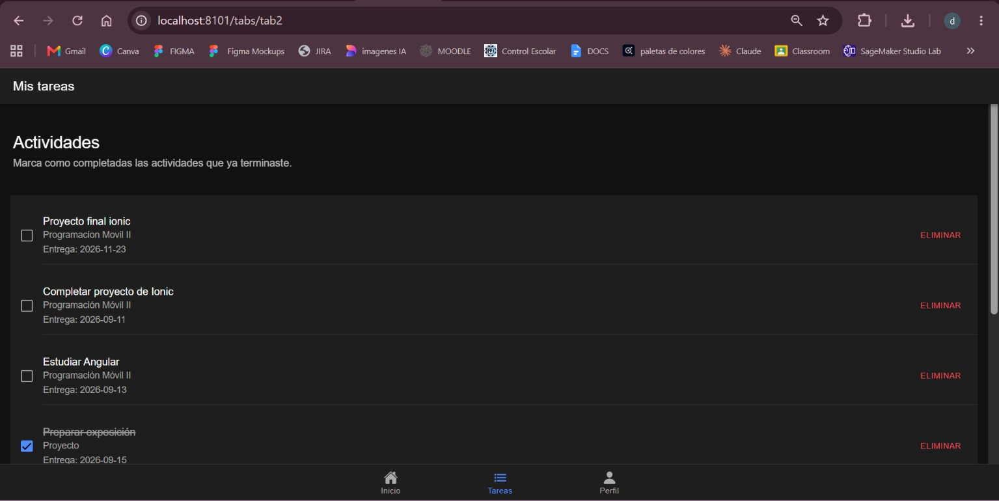
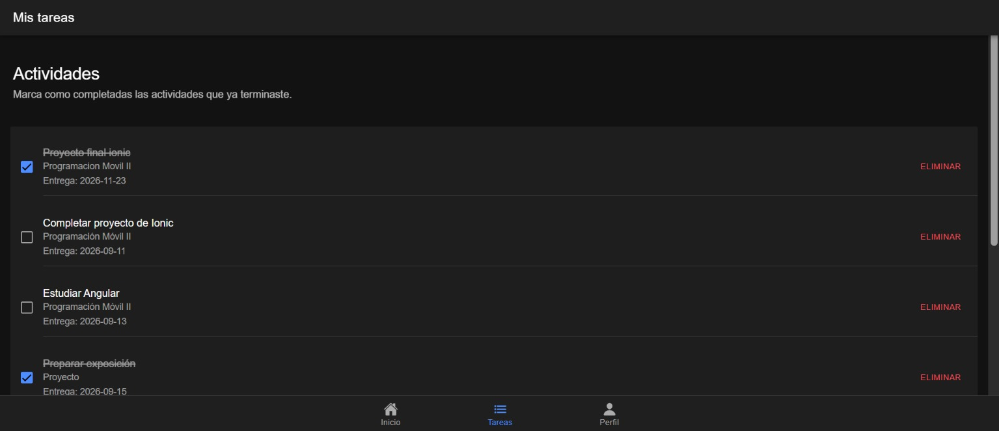
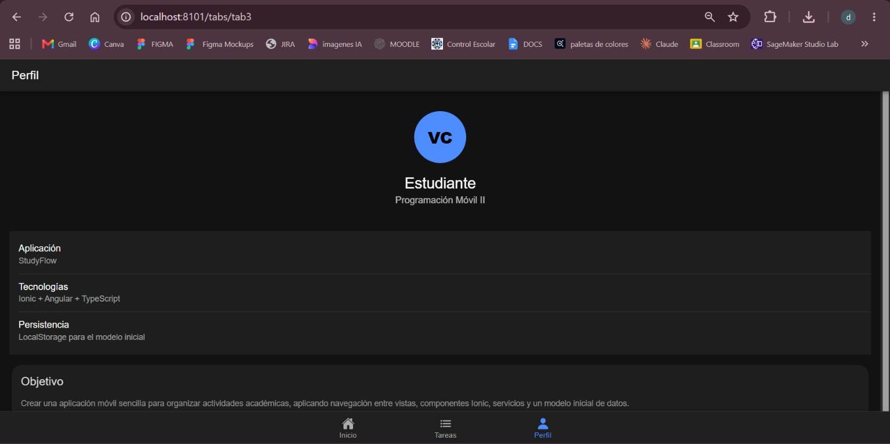
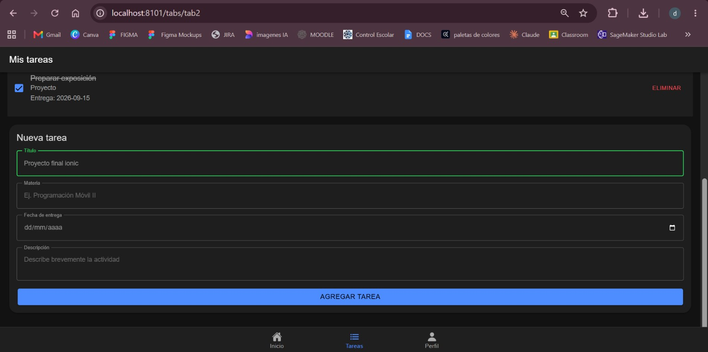
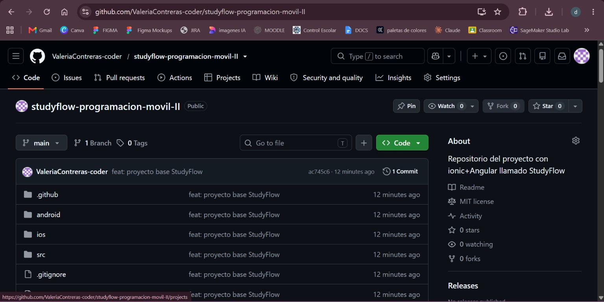
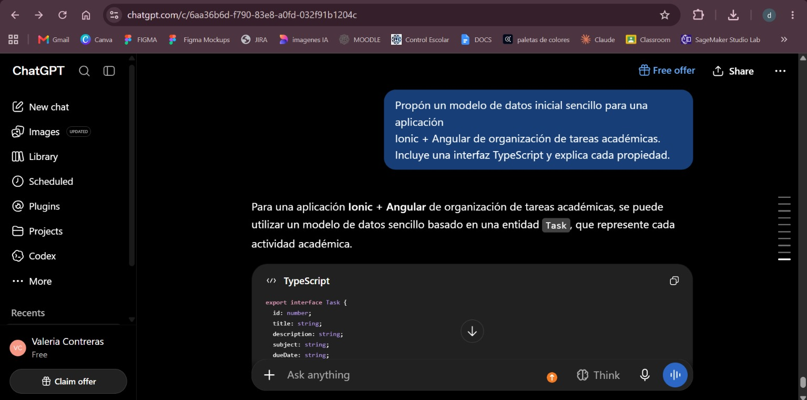
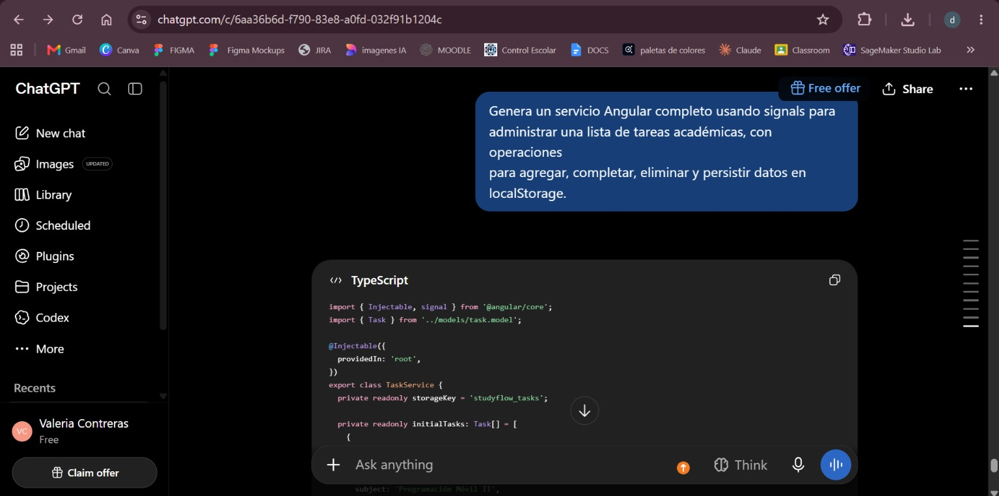
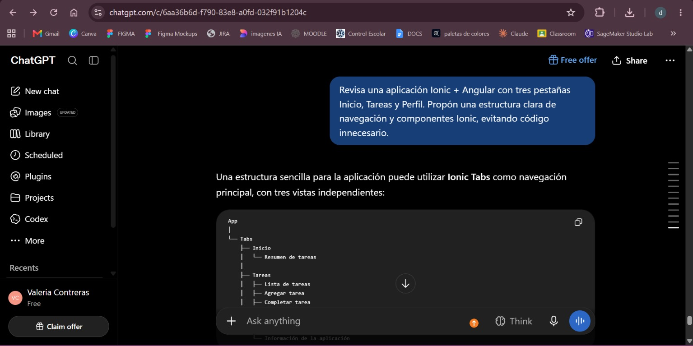

# StudyFlow — Proyecto base de Programación Móvil II

## Objetivo

StudyFlow es una aplicación móvil desarrollada con **Ionic + Angular** para organizar actividades académicas. La aplicación permite consultar un resumen de tareas, agregar actividades, marcarlas como completadas y eliminarlas.

## Tecnologías

- Ionic 9
- Angular 22
- TypeScript
- Capacitor
- LocalStorage
- Git / GitHub

## Vistas

1. **Inicio:** muestra un resumen de tareas y la próxima actividad pendiente.
2. **Tareas:** permite agregar, completar y eliminar actividades.
3. **Perfil:** muestra información de la aplicación, tecnologías y objetivo.

## Modelo inicial de datos

El modelo se encuentra en `src/app/models/task.model.ts`:

- `id`: identificador numérico.
- `title`: título de la actividad.
- `description`: descripción.
- `subject`: materia.
- `dueDate`: fecha de entrega.
- `completed`: indica si está terminada.

Los datos iniciales están en `src/app/services/task.service.ts` y se conservan en `localStorage`.

## Ejecución

```bash
npm install
ionic serve
```

También puede utilizarse:

```bash
npm start
```

## Git

Ejemplo de flujo:

```bash
git init
git add .
git commit -m "feat: proyecto base StudyFlow"
git branch -M main
git remote add origin URL_DE_TU_REPOSITORIO
git push -u origin main
```

## Evidencia de uso de IA

Se utilizaron prompts de apoyo para:

1. Diseñar el modelo inicial de datos.
2. Crear la lógica de un servicio Angular para administrar tareas.
3. Revisar y mejorar la navegación y las vistas Ionic.

### Prompt 1
> Propón un modelo de datos inicial sencillo para una aplicación Ionic + Angular de organización de tareas académicas. Incluye una interfaz TypeScript y explica cada propiedad.

### Prompt 2
> Genera un servicio Angular completo usando signals para administrar una lista de tareas académicas, con operaciones para agregar, completar, eliminar y persistir datos en localStorage.

### Prompt 3
> Revisa una aplicación Ionic + Angular con tres pestañas Inicio, Tareas y Perfil. Propón una estructura clara de navegación y componentes Ionic, evitando código innecesario.

## Decisiones sobre código generado por IA

- **Aceptado:** la estructura inicial del modelo `Task`, el servicio con operaciones CRUD básicas y parte de la estructura de las vistas.
- **Modificado:** nombres, textos, estilos, validaciones y navegación para adaptarlos al proyecto de la materia.
- **Descartado:** código relacionado con funcionalidades que no forman parte del objetivo actual, como la galería de fotografías y dependencias innecesarias para esta entrega.

## Evidencias de ejecución

### Vista Inicio



### Vista Tareas



### Agregar una tarea



### Tarea completada



### Vista Perfil



### Registro de ejecución



### Repositorio Git



## Evidencias de uso de IA

### Prompt 1 — Modelo de datos



### Prompt 2 — Servicio Angular



### Prompt 3 — Navegación



